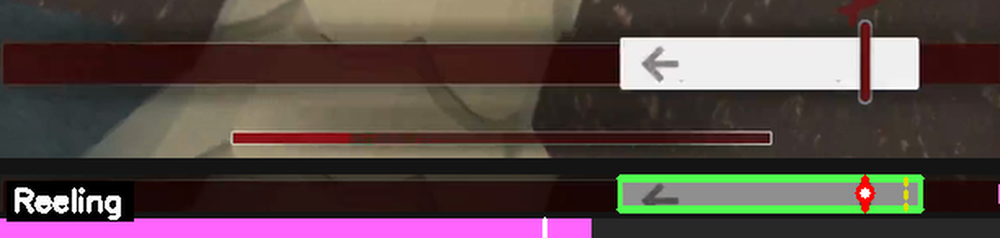
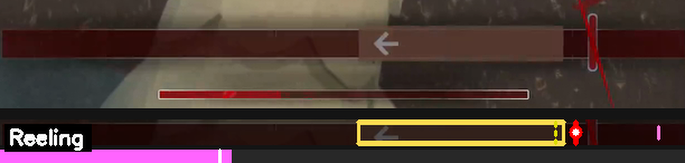
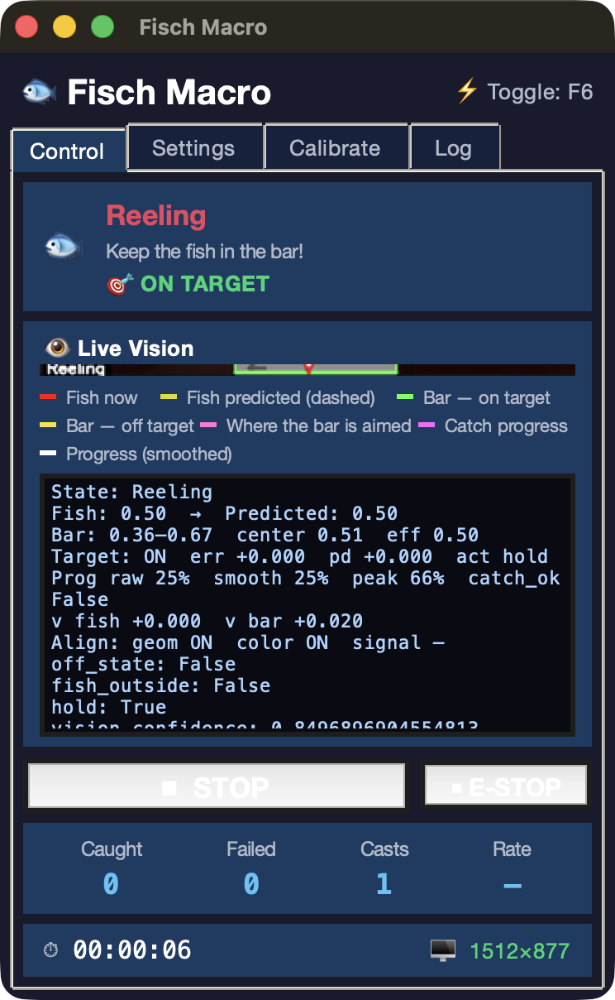
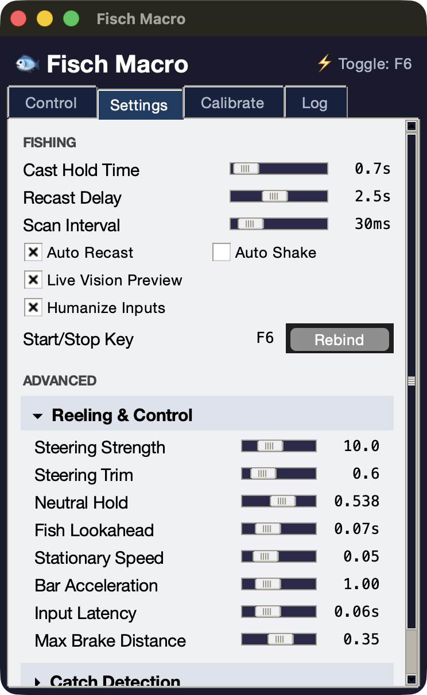
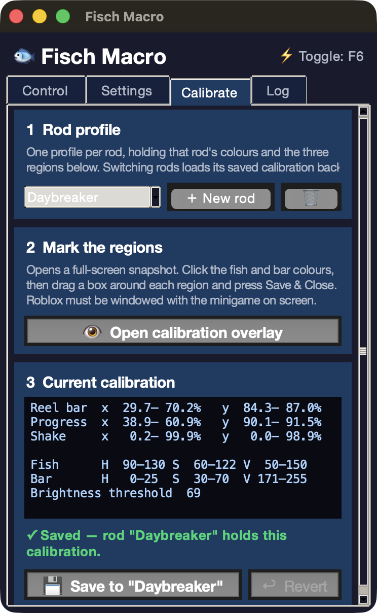
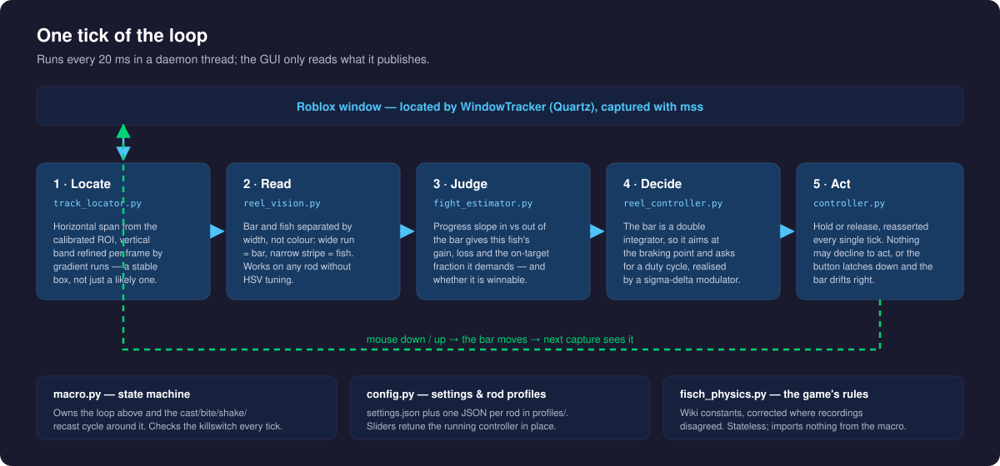
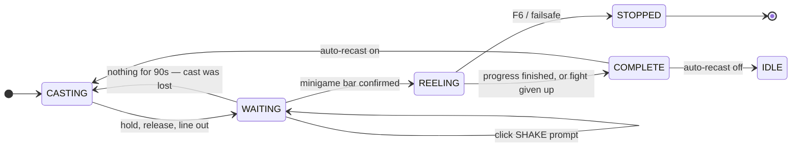

<div align="center">

# 🎣 Fisch Macro

**A vision-driven autofisher for Roblox _Fisch_ — it reads the reeling minigame off the screen, works out what it is fighting, and steers the bar with a closed-loop controller.**

No memory reading, no injection, no client patching. Just pixels in and mouse clicks out.


</div>



<sub><b>Top:</b> the reel track as the game draws it. <b>Bottom:</b> what the macro reads from those same pixels, column for column — a <b>green</b> bracket around the control bar, <b>red</b> on the fish inside it, a <b>dashed yellow</b> line where the fish is predicted to be next, and catch progress in <b>pink</b> underneath with the smoothed value ticked in white.</sub>

---

## Why it works when colour matching doesn't

The minigame looks different for every rod — the bar renders white, dark red, or a rainbow gradient, the fish is tinted by the rod, and the track background is near-black over lava and muted purple over stone. So the macro reads **structure, not colour**: inside the track strip, the wide contiguous run of not-background is the control bar and the narrow stripe is the fish. That holds for any rod, with no HSV tuning.



<sub>Another moment in the same fight. The game has recoloured the control bar — a translucent brown wash here, a solid white block above — and reading it as the wide run of not-background finds it either way. The bracket is amber because the fish (red) has got outside the bar, and the aim marker (magenta, far right) is out past the fish: the controller steers at the point the bar will <i>stop</i>, not at the fish itself.</sub>

The other half is control. The bar is a **double integrator** — holding accelerates it right, releasing accelerates it left, and there is no input that holds it still. Steering at where the fish *is* arrives at the fish going full speed and sails past it. So the controller aims at where the bar will stop once it has shed its velocity, and expresses "stay here" as a *duty cycle* — the fraction of ticks spent holding — realised with a sigma-delta modulator rather than plain on/off.

## Highlights

- **Rod-agnostic detection** — no per-rod colour calibration needed for the bar or the fish
- **Closed-loop reeling** — braking-point aim, duty-cycle steering, integral trim for the rod's asymmetry
- **Reads the fight, not the wiki** — progress slopes in and out of the bar give this fish's gain rate, loss rate, and the on-target fraction it demands
- **Knows when it has lost** — a fight whose demand exceeds what is achievable is dropped and recast rather than run for another half minute
- **Full cycle** — cast → wait → click SHAKE prompts → reel → recast, with a watchdog for casts that never landed
- **Live vision preview** — the annotated frame and its telemetry, in the control panel, while it runs
- **Global killswitch** — <kbd>F6</kbd> from inside the game; mouse to the top-left corner is a hard PyAutoGUI failsafe
- **Runs off a Mac** — macOS, Windows and Linux/X11, with a `--headless` mode for screens too small for the panel
- **Ships as an app** — one-command PyInstaller build, or download the artifact CI produces per platform

---

## Requirements

| | |
|---|---|
| **OS** | macOS, Windows, or Linux/X11 — see [Platforms](#platforms) |
| **Python** | 3.9 or newer |
| **Game** | Roblox running **windowed**, with the fishing UI on screen |
| **Permissions** | macOS: System Settings → Privacy & Security → **Accessibility** and **Screen Recording** for your terminal or Python |

## Platforms

The macro locates the game window, then measures every region of interest as a
*fraction* of it. So a platform is supported exactly when it can report that
window's rectangle.

| Platform | Window tracking | |
|---|---|---|
| macOS | Quartz `CGWindowListCopyWindowInfo` | Needs Accessibility + Screen Recording |
| Windows | Win32 `EnumWindows` + DWM frame bounds | Unsigned builds trip SmartScreen |
| Linux / X11 | `_NET_CLIENT_LIST` via python-xlib, `xdotool` fallback | Works with [Sober](https://sober.vinegarhq.org/) |
| Linux / Wayland | not possible | see below |

**Wayland cannot work.** Neither `mss` (capture) nor `pyautogui` (input) can
reach another application's surface under a Wayland compositor, which is the
default on Raspberry Pi OS. The macro detects a Wayland session and says so
rather than failing with empty captures. Switch to X11 with `sudo raspi-config`
→ Advanced Options → Wayland → X11, then log back in.

## Install

```bash
git clone https://github.com/obfuscated-tm/fisch-macro.git
cd fisch-macro

python3 -m venv venv
source venv/bin/activate

pip install -r requirements.txt
```

The platform window-tracking packages (`pyobjc-framework-Quartz` on macOS,
`python-xlib` on Linux) are declared with environment markers, so the right one
installs automatically. The GUI needs `tkinter` — bundled with python.org and
Homebrew builds; `sudo apt install python3-tk` on Debian/Ubuntu/Pi OS.

## Run

```bash
python3 main.py
```

An always-on-top control panel opens. Press **START** (or <kbd>F6</kbd> from anywhere) to begin; **F6** again, the **EMERGENCY STOP** button, or a mouse flick to the top-left corner stops it and releases the button.

<table>
<tr>
<td width="33%"></td>
<td width="33%"></td>
<td width="33%"></td>
</tr>
<tr>
<td align="center"><sub><b>Control</b> — live vision and stats</sub></td>
<td align="center"><sub><b>Settings</b> — retunes the running controller</sub></td>
<td align="center"><sub><b>Calibrate</b> — one profile per rod</sub></td>
</tr>
</table>

<sub>Logs stream to the **Log** tab and to `logs/macro.log`.</sub>

### Headless

The panel is 372x572 with a 340x500 minimum, so it does not fit a small screen
— an 800x480 Pi display cannot show it at all. For those, run without it:

```bash
python3 main.py --headless
```

Same engine, same <kbd>F6</kbd>, state and stats to the console:

```
[window] 800x480 at (0, 33), scale=1.0x
[macro] started
[state] Reeling
[stats] caught=12 failed=3 casts=15 rate=80% uptime=42m10s (17/hr)
```

| Flag | |
|---|---|
| `--headless` | Run without the GUI |
| `--no-autostart` | Wait for the hotkey instead of starting at once |
| `--profile NAME` | Switch rod profile before starting |
| `--list-profiles` | Print available profiles and exit |
| `--check-backend` | Report what the window tracker sees on this system, and exit |

`tkinter` is imported lazily, so this runs on a machine without it.

---

## Calibrate — once per rod

The **Calibrate** tab opens a full-screen snapshot of the game. Work through the six steps, then **Save & Close**; the result is stored as a rod profile in `profiles/` and reloaded whenever that rod is selected.

| Step | What to do |
|---|---|
| 1 · Fish colour | Click the fish icon inside the reel bar |
| 2 · Bar on target | Click the bar while it is green, sitting on the fish |
| 3 · Bar off target | Click the bar while it is white or orange |
| 4 · Reel bar area | Drag a box around the whole slider track, end to end |
| 5 · Progress bar | Drag a box over the catch progress bar below the track |
| 6 · Shake area | Drag a large box over where SHAKE prompts appear |

Step 4 is the one that matters most: the horizontal span of the track comes from it and never from a per-frame guess, because positions are normalised against that span — re-deriving it each tick makes a motionless bar look like it is moving, and the controller brakes against velocity that isn't there.

Four profiles ship as examples: `default`, `Daybreaker`, `Castbound`, `Evil Pitchfork`.

ROIs are stored as **fractions of the game window**, not screen pixels, so a
profile survives moving the window or changing display. Two consequences worth
knowing on a small screen:

- **Calibrate with the window at the size you will run it.** Roblox mixes
  proportional and fixed-pixel offsets, so the bar's *fractional* position
  shifts between 1080p and 800x480. Size the window first, then calibrate.
- **The progress ROI gets thin.** It spans about 1.4% of window height — some
  6 px at 480p against 15 at 1080p. That is near the floor for a reliable read
  and is usually what needs the most tuning.

### On a Raspberry Pi

There is no room for the calibration overlay on a 4" screen, so split it:
calibrate on an external monitor with the game window sized to the Pi's
resolution, then run `--headless` on the small display. Sober runs Roblox's
Android client, whose fishing UI is laid out differently from the desktop
one — expect to recalibrate rather than reuse a profile from a Mac or PC.

---

## How it works



The engine (`src/macro.py`) runs the whole cycle on a daemon thread, checking the killswitch on every iteration:



A few decisions worth knowing about:

- **Catch detection is guarded.** A finish is only believed after a confirmation streak, past a minimum reel time, and above a mid-game progress floor — VFX flashes otherwise spike progress to 1.0 for a frame and end a fight that is still running.
- **On-target is judged by progress, not geometry.** The bar's arrow glyphs sit *inside* it and read as the fish when the real fish is momentarily lost, so the geometric flag is measurably optimistic. Progress is the game's own verdict.
- **The game's constants are measured, not assumed.** `src/fisch_physics.py` holds the wiki's numbers with the recordings' corrections noted inline — progress moves at 12%/s, a flawless neutral catch takes 8.0 s, and the median fish's −40% Progress Speed pushes the required on-target fraction from 50% to 62.5%.

---

## Settings

Everything is in `settings.json` and every slider writes to it live — the **Settings** tab retunes the controller that is already running, no restart.

| Setting | Default | What it does |
|---|---|---|
| `killswitch_key` | `f6` | Global start/stop hotkey |
| `scan_interval_ms` | `20` | Loop period; lower is more responsive and more CPU |
| `cast_hold_time` | `0.68 s` | How long the cast click is held |
| `recast_delay` | `2.5 s` | Pause after a catch before recasting |
| `control_duty_kp` | `10.0` | Steering strength — duty per track-width of error |
| `control_duty_ki` | `0.6` | Steering trim; corrects a wrong neutral estimate per rod |
| `control_neutral_duty` | `0.538` | Hold fraction that cancels the bar's drift |
| `control_lead_seconds` | `0.07 s` | Fish lookahead; long leads amplify noise into overshoot |
| `min_catch_seconds` | `4.0 s` | Floor before a catch is believable |
| `auto_recast` / `shake_enabled` | `on` / `off` | Cycle automation toggles |
| `hunt_timeout_seconds` | `90 s` | Recast when a hunt produces nothing at all (`0` disables) |
| `humanize` | `on` | Scatter cast/recast/shake timings and click points instead of repeating them exactly |

If a rod consistently drifts to one wall, nudge **Neutral Hold**; if it oscillates around the fish, lower **Steering Strength** before touching anything else.

---

## Project layout

| Path | |
|---|---|
| `main.py` | Entry point — wires config, detector, controller, engine, GUI |
| `src/macro.py` | State machine and the cast/bite/reel/recast cycle |
| `src/reel_vision.py` | Structure-based read of the track: bar edges, fish, on-target |
| `src/track_locator.py` | Finds a *stable* track box; span from the ROI, band from the frame |
| `src/reel_controller.py` | Duty-cycle switching law over the double-integrator bar |
| `src/fight_estimator.py` | Measures this fight's gain/loss rates and whether it is winnable |
| `src/fisch_physics.py` | The game's rules, as documented and as measured. Stateless |
| `src/detector.py` | Screen capture, progress/shake reading, overlay rendering |
| `src/gui.py` · `src/interactive_calibrator.py` | Control panel and the full-screen calibration overlay |
| `src/window_tracker/` | Per-platform window lookup: Quartz, Win32/DWM, X11 |
| `src/headless.py` | The GUI-less runner and its console output |
| `src/humanize.py` | Timing and click scatter, and where it must not be applied |
| `src/paths.py` | Where settings live from a checkout vs a packaged build |
| `src/config.py` · `settings.json` · `profiles/` | Settings and per-rod calibration |

## Offline tooling

The vision and control code runs headless against recordings, which is how it gets changed without a rod in the water. Drop clips in `tests/clips/` (see [`tests/README.md`](tests/README.md)) and:

```bash
python3 scripts/extract_frames.py tests/clips/reel_basic.mov   # clip → frames
python3 scripts/test_detection.py                              # vision over frames + CSV
python3 scripts/measure_game_model.py                          # check the wiki's constants
python3 scripts/simulate_control.py                            # score control across the parameter grid
python3 scripts/closed_loop_test.py                            # render → see → decide → act, nothing stubbed
```

The closed-loop test is the honest one: the frame is rendered as pixels and read back with no knowledge of the true state, so a mislocated bar or a latched button shows up as a collapsing on-target number.

```bash
pip install pytest && python3 -m pytest tests/unit -q
```

---

## Standalone builds

```bash
pip install pyinstaller
pyinstaller fisch-macro.spec --noconfirm
```

Output lands in `dist/` — `FischMacro.app` on macOS, a `FischMacro/` folder
elsewhere. On Windows that folder holds two executables: `FischMacro.exe` for
the GUI and `FischMacro-cli.exe` for `--headless`, because a windowed Windows
binary has no stdout.

Roughly 168 MB, most of it OpenCV. A packaged build keeps settings and profiles
*outside* the bundle — in `~/Library/Application Support/FischMacro`,
`%APPDATA%\FischMacro`, or `~/.config/fisch-macro` — seeded from the bundled
defaults on first run, because a one-file build unpacks to a temp directory that
is deleted on exit.

Builds cannot be cross-compiled; each OS builds its own.
[`.github/workflows/build.yml`](.github/workflows/build.yml) does all of them and
attaches the artifacts to a release on tag push.

Neither build is signed by a certificate authority. macOS ad-hoc signs the
bundle, which gives it a stable identity so permission grants survive
relaunches, but Gatekeeper still warns — right-click then Open the first time.
On Windows, SmartScreen flags any unsigned binary, and Defender may object to a
program that injects input and captures the screen. That is inherent to what a
macro does, not a defect in the build.

---

## Troubleshooting

Start here — it exercises the real platform lookup and prints what it found:

```console
$ python3 main.py --check-backend
backend:  macOS/Quartz
window:   1512x882 at (0, 33)
scale:    1.0x
```


| Symptom | Cause |
|---|---|
| "Cannot locate Roblox window" | Run `python3 main.py --check-backend` first — it names the backend and says what it can see. Then check Roblox is windowed rather than fullscreen |
| Linux: black captures, clicks do nothing | A Wayland session. Switch to X11 — see [Platforms](#platforms) |
| Nothing clicks, hotkey dead | Accessibility permission not granted to the terminal/Python that launched it |
| Live vision is blank or misaligned | Recalibrate step 4; then nudge **ROI Shift X/Y** in Settings |
| Bar drifts to one wall | **Neutral Hold** is off for this rod — the integral trim needs a better starting point |
| Bar oscillates across the fish | Lower **Steering Strength**, then **Fish Lookahead** |
| Fish caught, macro keeps reeling | Raise **Min Catch Time** / **Post-Catch Lockout** — a VFX flash was read as progress |
| Casts forever, never bites | The cast is not landing; check **Cast Hold Time** and that the click lands in the water |

---

## Disclaimer

Automating gameplay is against the Roblox Terms of Use and can get an account moderated or banned. This exists as a computer-vision and control-systems exercise; run it on an account you are willing to lose, and don't run it for anyone else.
