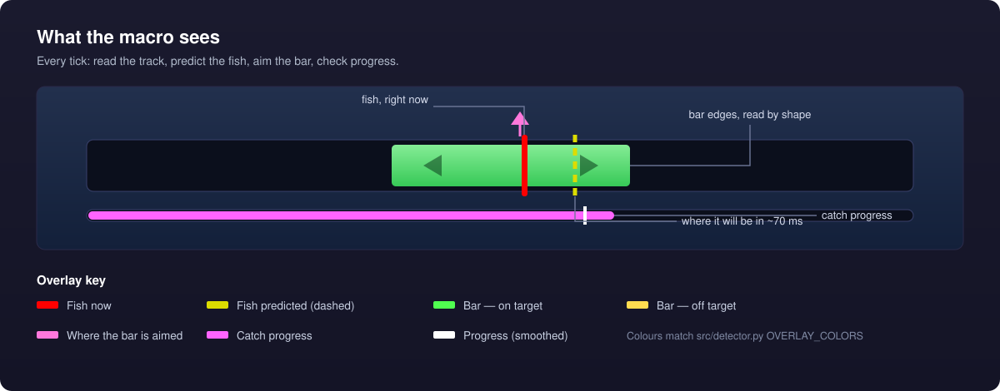
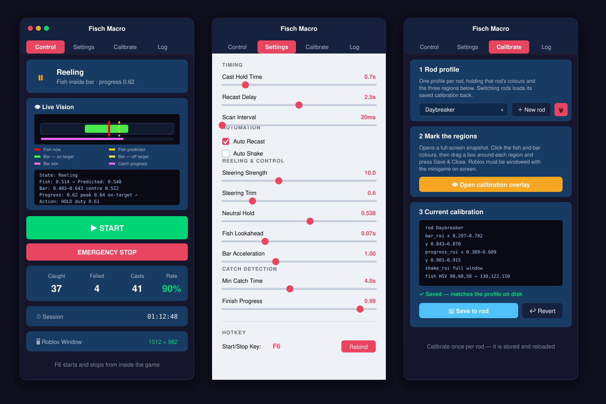
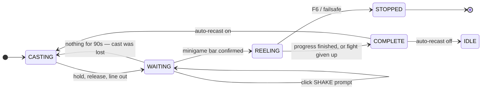

<div align="center">

# 🎣 Fisch Macro

**A vision-driven autofisher for Roblox _Fisch_ — it reads the reeling minigame off the screen, works out what it is fighting, and steers the bar with a closed-loop controller.**

No memory reading, no injection, no client patching. Just pixels in and mouse clicks out.


</div>



---

## Why it works when colour matching doesn't

The minigame looks different for every rod — the bar renders white, dark red, or a rainbow gradient, the fish is tinted by the rod, and the track background is near-black over lava and muted purple over stone. So the macro reads **structure, not colour**: inside the track strip, the wide contiguous run of not-background is the control bar and the narrow stripe is the fish. That holds for any rod, with no HSV tuning.

The other half is control. The bar is a **double integrator** — holding accelerates it right, releasing accelerates it left, and there is no input that holds it still. Steering at where the fish *is* arrives at the fish going full speed and sails past it. So the controller aims at where the bar will stop once it has shed its velocity, and expresses "stay here" as a *duty cycle* — the fraction of ticks spent holding — realised with a sigma-delta modulator rather than plain on/off.

## Highlights

- **Rod-agnostic detection** — no per-rod colour calibration needed for the bar or the fish
- **Closed-loop reeling** — braking-point aim, duty-cycle steering, integral trim for the rod's asymmetry
- **Reads the fight, not the wiki** — progress slopes in and out of the bar give this fish's gain rate, loss rate, and the on-target fraction it demands
- **Knows when it has lost** — a fight whose demand exceeds what is achievable is dropped and recast rather than run for another half minute
- **Full cycle** — cast → wait → click SHAKE prompts → reel → recast, with a watchdog for casts that never landed
- **Live vision preview** — the annotated frame and its telemetry, in the control panel, while it runs
- **Global killswitch** — <kbd>F6</kbd> from inside the game; mouse to the top-left corner is a hard PyAutoGUI failsafe

---

## Requirements

| | |
|---|---|
| **OS** | macOS — window tracking uses Quartz (`CGWindowListCopyWindowInfo`) |
| **Python** | 3.9 or newer |
| **Game** | Roblox running **windowed**, with the fishing UI on screen |
| **Permissions** | System Settings → Privacy & Security → **Accessibility** and **Screen Recording** for your terminal or Python |

## Install

```bash
git clone https://github.com/obfuscated-tm/fisch-macro.git
cd fisch-macro

python3 -m venv venv
source venv/bin/activate

pip install -r requirements.txt
pip install pyobjc-framework-Quartz     # macOS window + display-scale lookup
```

## Run

```bash
python3 main.py
```

An always-on-top control panel opens. Press **START** (or <kbd>F6</kbd> from anywhere) to begin; **F6** again, the **EMERGENCY STOP** button, or a mouse flick to the top-left corner stops it and releases the button.



<sub>Logs stream to the **Log** tab and to `logs/macro.log`.</sub>

---

## Calibrate — once per rod

The **Calibrate** tab opens a full-screen snapshot of the game. Work through the six steps, then **Save & Close**; the result is stored as a rod profile in `profiles/` and reloaded whenever that rod is selected.

| Step | What to do |
|---|---|
| 1 · Fish colour | Click the fish icon inside the reel bar |
| 2 · Bar on target | Click the bar while it is green, sitting on the fish |
| 3 · Bar off target | Click the bar while it is white or orange |
| 4 · Reel bar area | Drag a box around the whole slider track, end to end |
| 5 · Progress bar | Drag a box over the catch progress bar below the track |
| 6 · Shake area | Drag a large box over where SHAKE prompts appear |

Step 4 is the one that matters most: the horizontal span of the track comes from it and never from a per-frame guess, because positions are normalised against that span — re-deriving it each tick makes a motionless bar look like it is moving, and the controller brakes against velocity that isn't there.

Four profiles ship as examples: `default`, `Daybreaker`, `Castbound`, `Evil Pitchfork`.

---

## How it works


The engine (`src/macro.py`) runs the whole cycle on a daemon thread, checking the killswitch on every iteration:



A few decisions worth knowing about:

- **Catch detection is guarded.** A finish is only believed after a confirmation streak, past a minimum reel time, and above a mid-game progress floor — VFX flashes otherwise spike progress to 1.0 for a frame and end a fight that is still running.
- **On-target is judged by progress, not geometry.** The bar's arrow glyphs sit *inside* it and read as the fish when the real fish is momentarily lost, so the geometric flag is measurably optimistic. Progress is the game's own verdict.
- **The game's constants are measured, not assumed.** `src/fisch_physics.py` holds the wiki's numbers with the recordings' corrections noted inline — progress moves at 12%/s, a flawless neutral catch takes 8.0 s, and the median fish's −40% Progress Speed pushes the required on-target fraction from 50% to 62.5%.

---

## Settings

Everything is in `settings.json` and every slider writes to it live — the **Settings** tab retunes the controller that is already running, no restart.

| Setting | Default | What it does |
|---|---|---|
| `killswitch_key` | `f6` | Global start/stop hotkey |
| `scan_interval_ms` | `20` | Loop period; lower is more responsive and more CPU |
| `cast_hold_time` | `0.68 s` | How long the cast click is held |
| `recast_delay` | `2.5 s` | Pause after a catch before recasting |
| `control_duty_kp` | `10.0` | Steering strength — duty per track-width of error |
| `control_duty_ki` | `0.6` | Steering trim; corrects a wrong neutral estimate per rod |
| `control_neutral_duty` | `0.538` | Hold fraction that cancels the bar's drift |
| `control_lead_seconds` | `0.07 s` | Fish lookahead; long leads amplify noise into overshoot |
| `min_catch_seconds` | `4.0 s` | Floor before a catch is believable |
| `auto_recast` / `shake_enabled` | `on` / `off` | Cycle automation toggles |
| `hunt_timeout_seconds` | `90 s` | Recast when a hunt produces nothing at all (`0` disables) |

If a rod consistently drifts to one wall, nudge **Neutral Hold**; if it oscillates around the fish, lower **Steering Strength** before touching anything else.

---

## Project layout

| Path | |
|---|---|
| `main.py` | Entry point — wires config, detector, controller, engine, GUI |
| `src/macro.py` | State machine and the cast/bite/reel/recast cycle |
| `src/reel_vision.py` | Structure-based read of the track: bar edges, fish, on-target |
| `src/track_locator.py` | Finds a *stable* track box; span from the ROI, band from the frame |
| `src/reel_controller.py` | Duty-cycle switching law over the double-integrator bar |
| `src/fight_estimator.py` | Measures this fight's gain/loss rates and whether it is winnable |
| `src/fisch_physics.py` | The game's rules, as documented and as measured. Stateless |
| `src/detector.py` | Screen capture, progress/shake reading, overlay rendering |
| `src/gui.py` · `src/interactive_calibrator.py` | Control panel and the full-screen calibration overlay |
| `src/config.py` · `settings.json` · `profiles/` | Settings and per-rod calibration |

## Offline tooling

The vision and control code runs headless against recordings, which is how it gets changed without a rod in the water. Drop clips in `tests/clips/` (see [`tests/README.md`](tests/README.md)) and:

```bash
python3 scripts/extract_frames.py tests/clips/reel_basic.mov   # clip → frames
python3 scripts/test_detection.py                              # vision over frames + CSV
python3 scripts/measure_game_model.py                          # check the wiki's constants
python3 scripts/simulate_control.py                            # score control across the parameter grid
python3 scripts/closed_loop_test.py                            # render → see → decide → act, nothing stubbed
```

The closed-loop test is the honest one: the frame is rendered as pixels and read back with no knowledge of the true state, so a mislocated bar or a latched button shows up as a collapsing on-target number.

```bash
pip install pytest && python3 -m pytest tests/unit -q
```

---

## Troubleshooting

| Symptom | Cause |
|---|---|
| "Cannot locate Roblox window" | `pip install pyobjc-framework-Quartz`, and run Roblox windowed rather than fullscreen |
| Nothing clicks, hotkey dead | Accessibility permission not granted to the terminal/Python that launched it |
| Live vision is blank or misaligned | Recalibrate step 4; then nudge **ROI Shift X/Y** in Settings |
| Bar drifts to one wall | **Neutral Hold** is off for this rod — the integral trim needs a better starting point |
| Bar oscillates across the fish | Lower **Steering Strength**, then **Fish Lookahead** |
| Fish caught, macro keeps reeling | Raise **Min Catch Time** / **Post-Catch Lockout** — a VFX flash was read as progress |
| Casts forever, never bites | The cast is not landing; check **Cast Hold Time** and that the click lands in the water |

---

## Disclaimer

Automating gameplay is against the Roblox Terms of Use and can get an account moderated or banned. This exists as a computer-vision and control-systems exercise; run it on an account you are willing to lose, and don't run it for anyone else.
